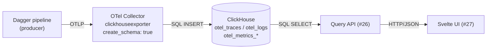

# otelhouse

otelhouse is a Dagger-orchestrated end-to-end harness for the
`Dagger → OpenTelemetry → upstream Collector → ClickHouse → Svelte UI`
observability stack. It exists to prove that the pipeline works as an
integration unit, not to publish any reusable library — there is nothing
to `go get` from this repository.

The high-level design comes from epic
[#32](https://github.com/guettli/otelhouse/issues/32).

## Architecture



`ci/main.go` wires every box of this diagram together in a single Dagger
pipeline, then runs sample traffic through it and asserts the result.

## Ingestion is codeless

The Collector owns ingestion end-to-end. There is no custom exporter, no
custom schema and no Go code in this repository on the write path:

- The upstream
  [`clickhouseexporter`](https://github.com/open-telemetry/opentelemetry-collector-contrib/tree/main/exporter/clickhouseexporter)
  in the standard
  [`otelcol-contrib`](https://github.com/open-telemetry/opentelemetry-collector-releases)
  distribution writes traces, logs and metrics directly.
- `create_schema: true` makes the exporter create the `otel_traces`,
  `otel_logs` and `otel_metrics_*` tables (plus their materialized views
  and TTLs) on startup — no migrations to run.
- The in-process Go exporter that previously lived here was removed in
  [#25](https://github.com/guettli/otelhouse/issues/25); it duplicated
  the upstream exporter and was a maintenance liability.

Producers in the pipeline are configured against an OTLP/gRPC endpoint
the same way they would be in production; nothing on the producer side
is otelhouse-specific.

## Querying needs custom code

OTel deliberately specifies ingestion (OTLP, semantic conventions) but
*not* a query API: how you ask "show me the spans for run X with their
child logs" is left to whatever store you chose. ClickHouse is no
different — it gives you SQL, not OTel.

A thin layer is therefore needed on top of the Collector's tables, and
that layer is what this repository builds:

- **Query API** ([#26](https://github.com/guettli/otelhouse/issues/26)) —
  a small read-only service over the `otel_traces` / `otel_logs` /
  `otel_metrics_*` tables exposing endpoints like `GET /api/runs`,
  `GET /api/traces/:id` and `GET /api/logs?traceId=:id`.
- **Svelte UI** ([#27](https://github.com/guettli/otelhouse/issues/27)) —
  a SvelteKit frontend rendering a dashboard of recent Dagger runs and a
  per-run detail page with a Gantt waterfall of spans and a log viewer
  keyed by span.

### Existing ClickHouse UI tools

For ad-hoc SQL the generic tooling that ships around ClickHouse already
works against the `otel_*` tables and needs no setup beyond a DSN:

- ClickHouse's built-in HTTP **Play UI** (`http://<host>:8123/play`) —
  bundled with the server, good for quick `SELECT`s.
- [Tabix](https://tabix.io/) — browser-only SQL IDE talking to the HTTP
  interface.
- The [Grafana ClickHouse plugin](https://grafana.com/grafana/plugins/grafana-clickhouse-datasource/)
  — dashboards and ad-hoc exploration.

Those tools answer "run an arbitrary SQL query"; they do not render a
trace as a waterfall or stitch logs onto spans. That trace-shaped view
is what the API + Svelte UI in this repo add on top.

## Running it end-to-end

The [Dagger](https://dagger.io/) pipeline in `ci/main.go` is the **single
source of truth** for tests. Running it locally is byte-identical to
what GitHub Actions runs, so a green local run implies a green CI run:

```sh
make test          # == cd ci && go run .
```

The pipeline stands up its own ephemeral, version-pinned ClickHouse via
a Dagger service binding — there is nothing to install or start by hand,
and no separate local stack to keep in sync. A reachable Dagger engine
is the only prerequisite; to use a remote engine, export
`_EXPERIMENTAL_DAGGER_RUNNER_HOST` before running.

There is intentionally **no** `docker-compose` (or other) parallel test
environment: a second definition of ClickHouse would drift from
`ci/main.go` and break the "green locally ⇒ green in CI" guarantee. See
[#33](https://github.com/guettli/otelhouse/issues/33).

The pipeline runs:

1. `gofmt` — format check
2. `go vet` — static analysis
3. `golangci-lint` — lint (`v2.12.2`)
4. `go build` — compilation
5. `go test` — integration tests against a live ClickHouse 25.5 service
6. **End-to-end harness** — stands up the upstream
   `otel/opentelemetry-collector-contrib` (with
   [`ci/otel-collector-config.yaml`](ci/otel-collector-config.yaml))
   pointed at the same ClickHouse service, drives sample OTLP
   traces/metrics/logs into it with the in-repo `otelhouse-emit`
   binary, runs the
   `otelhouse-api` binary as a Dagger service against ClickHouse, and
   runs the `TestE2E_API` Go test (build tag `e2e`) which hits
   `/api/runs`, `/api/traces/:id` and `/api/logs?traceId=:id` and asserts
   the API renders the ingested data. This is the
   `Dagger → OTLP → Collector → ClickHouse → API` guarantee for the whole
   harness — one pipeline run validates everything end-to-end.

## Connecting traces and logs

The upstream `clickhouseexporter` writes `TraceId` and `SpanId` columns
to both `otel_traces` and `otel_logs`, so a log emitted inside an active
span joins back to that span with no custom schema:

```sql
SELECT t.SpanName, l.Body
FROM otel_traces  t
JOIN otel_logs    l USING (TraceId, SpanId)
```

For the join to work, producers must emit log records while a span is
active — start the span (`tracer.Start(ctx, ...)`) before the log call
so the OTel SDK stamps the span context onto the record. A log with an
empty `SpanId` cannot be linked to a span, and a Collector pipeline that
strips `TraceId`/`SpanId` (e.g. via `attributes/delete`) breaks the
join.

This is the data foundation the API
([#26](https://github.com/guettli/otelhouse/issues/26)) and the
visualization UI ([#27](https://github.com/guettli/otelhouse/issues/27))
build on to render hyperlinks between a span and its logs (and back).
