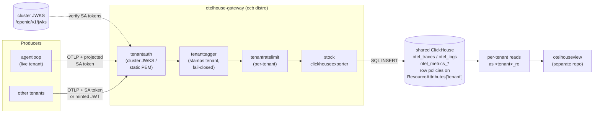

# otelhouse

otelhouse is two things built around the
`OpenTelemetry → upstream Collector → ClickHouse` pipeline:

1. **A deployed artifact — the multi-tenant OTLP gateway.** A custom
   OpenTelemetry Collector distribution (`tenantauth` + `tenanttagger` +
   `tenantratelimit` around the **stock** `clickhouseexporter`) published as a
   container image, `ghcr.io/guettli/otelhouse-gateway`. Producers
   authenticate with their **Kubernetes ServiceAccount token** — the identity
   the kubelet already issues and rotates for every pod — or, if they are not
   in-cluster pods, with a minted JWT verified against a static public key.
   It is **live**: deployed from [gitops](https://github.com/guettli/gitops)
   (epic [gitops#73](https://github.com/guettli/gitops/issues/73)) and already
   serving **agentloop as a real tenant** — agentloop pushes OTLP with its
   token and reads its rows back as the `agentloop_ro` ClickHouse user.
   Many tenants share **one ClickHouse** with per-tenant write and read
   isolation. This is the reusable output of the repo.
2. **A Dagger-orchestrated end-to-end harness** for the
   `Dagger → OTLP → Collector → ClickHouse` stack, proving the pipeline works
   as an integration unit.

otelhouse is the **write path**. Reading is
[otelhouseview](https://github.com/guettli/otelhouseview): the
`otelhouseview/otelstore` library (a read-only, typed client over the stock
`otel_traces` / `otel_logs` tables) plus the service and UI built on it. This
repo ships no query API of its own — the e2e harness here reads back what it
wrote through that same library.

There is nothing to `go get` here — the shipped artifact is the gateway
**image**. The high-level design comes from epics
[#32](https://github.com/guettli/otelhouse/issues/32) and
[#53](https://github.com/guettli/otelhouse/issues/53).

## Why otelhouse exists

The parts that make up an OTLP → ClickHouse pipeline each already work on
their own, but nothing bridged them under the exact constraints we need:
one shared ClickHouse, the **stock `clickhouseexporter` schema** (so every
tenant gets Grafana's default OTel dashboards for free), hundreds–thousands
of tenants, with **per-tenant credential-bound write isolation** and
**per-tenant read isolation**.

- The stock **OpenTelemetry Collector + `clickhouseexporter`** writes
  OTLP → ClickHouse with the canonical `otel_*` schema — but it is
  **single-tenant**: one shared token, no per-tenant identity, no
  per-tenant write enforcement, no read isolation.
- Full products on ClickHouse — **Uptrace**, **SigNoz**, **ClickStack /
  HyperDX** — either ship their **own non-stock schema** (Uptrace bundles
  its own schema plus PostgreSQL and its own UI) or are **single-tenant in
  OSS** (SigNoz, ClickStack). Multi-tenanting them means running one whole
  stack per tenant.
- **No tool provided the exact bridge**: stock schema, one ClickHouse, many
  tenants, credential-bound at both write and read time.

otelhouse is the **thin bridge** that adds only the missing piece — a
`tenantauth` extension (Kubernetes ServiceAccount tokens, or minted JWTs)
plus a `tenanttagger` processor that stamps the tenant onto every record
from the verified token — while keeping every
other part **stock**: stock OTLP receiver, stock `clickhouseexporter` and
schema, ClickHouse row policies for reads. It deliberately does **not**
reinvent the exporter or the schema.

See [#53](https://github.com/guettli/otelhouse/issues/53) and the gitops
epic [guettli/gitops#73](https://github.com/guettli/gitops/issues/73) for
the broader multi-tenancy design.

## Multi-tenant gateway

The custom Collector distribution lives in [`collector/`](collector/):

- [`extension/tenantauth`](collector/extension/tenantauth) verifies the
  bearer token on every OTLP request and resolves the tenant it may write as
  into the auth context. Two identity sources, either or both enabled:
  - **Kubernetes ServiceAccount tokens** (the default for in-cluster
    producers). A projected SA token is an RS256 JWT signed by the API
    server; the extension verifies it against the **cluster JWKS**
    (`/openid/v1/jwks`, cached, refreshed on an unknown `kid`), requires the
    producer to have projected it with `audience: otelhouse-gateway` — so a
    token minted for the API server is not replayable at the gateway — and
    derives the tenant from the signed ServiceAccount identity: the namespace
    claim, or an explicit `<namespace>/<serviceaccount>` → tenant map for
    producers whose namespace is not their tenant. **Unmapped identities are
    rejected, never defaulted.** No secret to mint, distribute or rotate.
  - **Static-PEM minted JWTs** (EdDSA/ES256/RS256) for any producer that is
    not an in-cluster pod: verified against a public key in the config, with
    the tenant in a signed claim.

  Algorithm pinning (never HS\*, never `alg:none`), `iss`/`aud`/`exp` checks,
  unknown `kid`, unmapped ServiceAccounts and tenant-spoofing attempts are
  covered by
  [`extension_test.go`](collector/extension/tenantauth/extension_test.go).
- [`processor/tenanttagger`](collector/processor/tenanttagger) reads the
  authenticated tenant from `client.Info` and stamps it as
  `resource.attributes["tenant"]`, deleting any client-supplied value.
  It is **fail-closed**: a batch arriving without a resolved tenant is
  dropped, not written unlabelled ([`processor_test.go`](collector/processor/tenanttagger/processor_test.go)).
- [`processor/tenantratelimit`](collector/processor/tenantratelimit)
  enforces a per-tenant ingest rate keyed off the same signed claim.
  Over-limit batches are rejected with gRPC `RESOURCE_EXHAUSTED` /
  HTTP `429` and counted on
  `otelhouse_gateway_ratelimit_dropped_total{tenant}` — no silent drop.
  Limits are configurable per tenant with a global default; buckets are
  in-memory per-replica.
- [`builder-config.yaml`](collector/builder-config.yaml) is the ocb config
  that pins upstream receiver/processor/exporter versions and pulls in
  the three custom components — nothing else changes on the write path, so
  the stock `clickhouseexporter` schema is preserved unchanged.
- [`docs/jwt-contract.md`](docs/jwt-contract.md) is the wire contract for
  both identity sources (claims, algorithms, iss/aud, how the tenant is
  derived) — and why the tenant may only ever come from a verified token.
- [`docs/metrics.md`](docs/metrics.md) documents the per-tenant ingest and
  auth-rejection Prometheus metrics the gateway emits — the operator's
  view into "who is sending how much" and "which tenant just went silent
  because a token expired."

### Deploying & consuming the gateway

The gateway is built and published as `ghcr.io/guettli/otelhouse-gateway` by
CI on every push to `main` (see `ci/`). It is **deployed and operated from
[gitops](https://github.com/guettli/gitops)**, not from here — this repo owns
the code and the image; gitops owns the running stack, the shared ClickHouse,
the keypair and the per-tenant secrets. The production wiring lives under
`k8s/plain/otelhouse/` in gitops and is described in epic gitops#73.

A tenant connects to the running gateway like any OTLP endpoint, plus a token.

**In-cluster producers (the default): no secret at all.** The gateway is a
ClusterIP Service with no IngressRoute, so every producer today is a pod in
the cluster — and every pod already has a cryptographically verifiable
identity the kubelet issues and rotates. Project it for the gateway:

```yaml
volumes:
  - name: otlp-token
    projected:
      sources:
        - serviceAccountToken:
            audience: otelhouse-gateway
            expirationSeconds: 3600
            path: token
```

1. Mount that volume and send OTLP with
   `Authorization: Bearer $(cat /var/run/secrets/otelhouse/token)` (build
   `OTEL_EXPORTER_OTLP_HEADERS` from the file the kubelet keeps fresh).
2. The gateway verifies the token against the cluster's JWKS, checks it was
   projected for **this** audience, derives the tenant from the signed
   ServiceAccount identity (namespace, or an explicit SA→tenant map entry),
   stamps `ResourceAttributes['tenant']` and writes via the stock exporter.
   An identity that maps to no tenant is rejected — never defaulted.
3. Reads are isolated by ClickHouse row policies bound to a per-tenant
   `<tenant>_ro` user, so a tenant sees only its own rows and can point
   Grafana's default OTel dashboards straight at the shared database.

Nothing to mint, nothing to rotate, nothing to expire: the `audience:` line
in the Pod spec is the whole enrolment.

**Producers that are not in-cluster pods:** the operator mints a per-tenant
JWT with the private key held in gitops and the tenant sends it as
`Authorization: Bearer <jwt>`; the gateway verifies it against the configured
public key and reads the tenant from the signed `tenant` claim. Those tokens
are short-lived and re-minted before expiry operator-side (gitops#89), so the
signing key never enters the cluster.

Both paths are documented claim-by-claim in
[`docs/jwt-contract.md`](docs/jwt-contract.md), which also spells out why the
tenant may only ever come from a verified token: every other tenant's
row-policy isolation depends on that label being unforgeable, so a
client-supplied `tenant` resource attribute is always overwritten, and a
batch whose tenant cannot be derived from a verified claim is dropped.

## Architecture

The deployed reality — producers authenticate with their Kubernetes
ServiceAccount token (or, if they are not in-cluster pods, a minted JWT), the
gateway derives and stamps the tenant from the verified claims, the stock
exporter writes, and reads are constrained by ClickHouse row policies bound to
a per-tenant `<tenant>_ro` user:


```mermaid
flowchart LR
    subgraph Producers
        Agentloop["agentloop<br/>(live tenant)"]
        Prod["other tenants"]
    end

    subgraph GW["otelhouse-gateway (ocb distro)"]
        direction LR
        Auth["tenantauth<br/>(cluster JWKS /<br/>static PEM)"]
        Tag["tenanttagger<br/>(stamps tenant,<br/>fail-closed)"]
        RL["tenantratelimit<br/>(per-tenant)"]
        Exp["stock<br/>clickhouseexporter"]
        Auth --> Tag --> RL --> Exp
    end

    K8S[("cluster JWKS<br/>/openid/v1/jwks")]
    K8S -. "verify SA tokens" .-> Auth

    CH[("shared ClickHouse<br/>otel_traces / otel_logs<br/>otel_metrics_*<br/>row policies on<br/>ResourceAttributes['tenant']")]
    RO["per-tenant reads<br/>as &lt;tenant&gt;_ro"]
    View["otelhouseview<br/>(separate repo)"]

    Agentloop -- "OTLP + projected<br/>SA token" --> Auth
    Prod -- "OTLP + SA token<br/>or minted JWT" --> Auth
    Exp -- "SQL INSERT" --> CH
    CH --> RO --> View
```

Separately, `ci/` exercises a **stock-collector harness**: a Dagger pipeline
drives sample OTLP into an upstream `otelcol-contrib` (config in
[`ci/otel-collector-config.yaml`](ci/otel-collector-config.yaml)) pointed at an
ephemeral ClickHouse, then reads the rows back with `otelhouseview/otelstore`
and asserts them. That harness has no tenant layer — it proves the
`OTLP → Collector → ClickHouse` plumbing and the stock schema, not the gateway's
multi-tenancy (the gateway's own components are covered by their unit tests and
by the gateway image build in `ci/gateway.go`).

## Ingestion into ClickHouse is codeless

To be precise about what is and is not custom: the **gateway** is Go code —
`tenantauth`, `tenanttagger` and `tenantratelimit` all sit directly on the write
path (`otlp → tenanttagger → tenantratelimit → memory_limiter → batch →
clickhouseexporter`). What is codeless is the last hop: **writing into
ClickHouse**. There is no custom exporter, no custom schema and no migrations
in this repository.

- The upstream
  [`clickhouseexporter`](https://github.com/open-telemetry/opentelemetry-collector-contrib/tree/main/exporter/clickhouseexporter)
  writes traces, logs and metrics directly. It is pulled in **unmodified** as a
  pinned upstream module by [`collector/builder-config.yaml`](collector/builder-config.yaml),
  so `SHOW CREATE TABLE otel.otel_traces` is byte-identical to a fresh stock
  install. (The shipped gateway is an **ocb-built binary**, not the
  [`otelcol-contrib`](https://github.com/open-telemetry/opentelemetry-collector-releases)
  distribution — contrib is only used as the collector in the `ci/` harness.)
- `create_schema: true` makes the exporter create the `otel_traces`,
  `otel_logs` and `otel_metrics_*` tables (plus their materialized views
  and TTLs) on startup — no migrations to run.
- The in-process Go exporter that previously lived here was removed in
  [#25](https://github.com/guettli/otelhouse/issues/25); it duplicated
  the upstream exporter and was a maintenance liability.

Producers speak plain OTLP/gRPC — but in production they are **not** entirely
otelhouse-agnostic: a producer must present `Authorization: Bearer <token>` (its
projected ServiceAccount token, or a minted JWT if it is not an in-cluster pod),
or `tenantauth` rejects the request and `tenanttagger` fail-closes and drops the
batch rather than writing it unlabelled. Only the `ci/` harness producer is
config-only agnostic, because that harness runs a stock collector with no auth on
a private Dagger network.

### Redaction is codeless too

Secrets sometimes slip into telemetry — an access key logged in an error
string, a token stuffed into a span attribute. otelhouse scrubs them **before
they land in ClickHouse**, and does it without a line of write-path Go:

- The rules come from [gitleaks](https://github.com/gitleaks/gitleaks): a
  pinned copy of its default ruleset lives in
  [`collector/gitleaks.toml`](collector/gitleaks.toml).
- [`collector/gen-gitleaks-rules`](collector/gen-gitleaks-rules) is an offline
  generator (run by hand, not at build time) that expands each rule's regex
  into stock `transform`/OTTL statements and writes
  [`collector/redaction.yaml`](collector/redaction.yaml) — committed, so the
  full expanded regex set shows up in review. The header pins the gitleaks
  version it was generated from.
- `redaction.yaml` is a full config fragment defining the processor. The
  collector deep-merges it in as a second `--config` file, so the base config
  only references `transform/redaction` by name in its pipelines. (It is merged
  rather than embedded via `${file:...}`: value-embedding the large regex set
  wraps every statement in confmap's expansion machinery, which fails to
  resolve — "too many recursive expansions".)
- The processor runs ahead of `batch` on the logs and traces pipelines,
  replacing any matching substring in a log body or a log/span attribute value
  with `REDACTED:<ruleID>`. It is the unmodified upstream `transformprocessor`
  (added to [`builder-config.yaml`](collector/builder-config.yaml)); only the
  rule pack is generated, so this stays consistent with "stock components only".

Refreshing after a gitleaks release is mechanical: bump the version in
`collector/gitleaks.toml`, rerun the generator, review the `redaction.yaml`
diff, commit. The `ci/` harness proves it end to end — `redaction_test.go`
sends a fake-but-rule-matching AWS key straight at the Collector and asserts the
row in ClickHouse carries `REDACTED:aws-access-token` and never the literal.

## Querying lives in otelhouseview

OTel deliberately specifies ingestion (OTLP, semantic conventions) but
*not* a query API: how you ask "show me the spans for run X with their
child logs" is left to whatever store you chose. ClickHouse is no
different — it gives you SQL, not OTel.

That thin read layer is **not** in this repository. It lives in
[otelhouseview](https://github.com/guettli/otelhouseview):
`github.com/guettli/otelhouseview/otelstore` is a read-only, typed client over
the stock `otel_traces` / `otel_logs` tables (`ListTraces`, `GetTrace`), and
the viewer's service and UI are built on it. It is deliberately tenant-blind:
the isolation boundary is the ClickHouse identity in the DSN plus row policies,
not a filter in Go. The e2e harness here is a consumer of that library like any
other.

### Existing ClickHouse UI tools

For ad-hoc SQL the generic tooling that ships around ClickHouse already
works against the `otel_*` tables and needs no setup beyond a DSN:

- ClickHouse's built-in HTTP **Play UI** (`http://<host>:8123/play`) —
  bundled with the server, good for quick `SELECT`s.
- [Tabix](https://tabix.io/) — browser-only SQL IDE talking to the HTTP
  interface.
- The [Grafana ClickHouse plugin](https://grafana.com/grafana/plugins/grafana-clickhouse-datasource/)
  — dashboards and ad-hoc exploration.

Those tools answer "run an arbitrary SQL query"; they do not render a
trace as a waterfall or stitch logs onto spans. That trace-shaped view
is what otelhouseview adds on top.

## Running it end-to-end

The [Dagger](https://dagger.io/) pipeline in `ci/main.go` is the **single
source of truth** for tests. Running it locally is byte-identical to
what GitHub Actions runs, so a green local run implies a green CI run:

```sh
make test          # == cd ci && go run .
```

The pipeline stands up its own ephemeral, version-pinned ClickHouse via
a Dagger service binding — there is nothing to install or start by hand,
and no separate local stack to keep in sync. A reachable Dagger engine
is the only prerequisite; to use a remote engine, export
`_EXPERIMENTAL_DAGGER_RUNNER_HOST` before running.

There is intentionally **no** `docker-compose` (or other) parallel test
environment: a second definition of ClickHouse would drift from
`ci/main.go` and break the "green locally ⇒ green in CI" guarantee. See
[#33](https://github.com/guettli/otelhouse/issues/33).

The pipeline runs:

1. `gofmt` — format check
2. `go vet` — static analysis
3. `golangci-lint` — lint (`v2.12.2`)
4. `go build` — compilation
5. `go test` — integration tests against a live ClickHouse 25.5 service
6. **End-to-end harness** — stands up the upstream
   `otel/opentelemetry-collector-contrib` (with
   [`ci/otel-collector-config.yaml`](ci/otel-collector-config.yaml))
   pointed at the same ClickHouse service, drives sample OTLP
   traces/metrics/logs into it with the in-repo `otelhouse-emit`
   binary, and runs the `TestE2E_Store` Go test (build tag `e2e`), which
   reads the rows back out of ClickHouse through
   `github.com/guettli/otelhouseview/otelstore` and asserts the ingested
   traces and logs are there. This is the
   `Dagger → OTLP → Collector → ClickHouse` guarantee for the whole
   harness — one pipeline run validates the write path end-to-end, read
   back with the same library the viewer uses.

## Connecting traces and logs

The upstream `clickhouseexporter` writes `TraceId` and `SpanId` columns
to both `otel_traces` and `otel_logs`, so a log emitted inside an active
span joins back to that span with no custom schema:

```sql
SELECT t.SpanName, l.Body
FROM otel_traces  t
JOIN otel_logs    l USING (TraceId, SpanId)
```

For the join to work, producers must emit log records while a span is
active — start the span (`tracer.Start(ctx, ...)`) before the log call
so the OTel SDK stamps the span context onto the record. A log with an
empty `SpanId` cannot be linked to a span, and a Collector pipeline that
strips `TraceId`/`SpanId` (e.g. via `attributes/delete`) breaks the
join.

This is the data foundation otelhouseview builds on to render hyperlinks
between a span and its logs (and back).

## Connecting metrics to traces and logs

Metrics carry less context than a span or log record, so the upstream
`clickhouseexporter` writes them into per-type tables — `otel_metrics_gauge`,
`otel_metrics_sum`, `otel_metrics_histogram`,
`otel_metrics_exponential_histogram` and `otel_metrics_summary` — and
correlation works at two levels:

**Coarse correlation by service / resource.** Every signal table — traces,
logs and the metric tables alike — carries `ServiceName` and
`ResourceAttributes`, so dashboards pivot on those without any per-row link.

**Fine correlation via exemplars.** `otel_metrics_sum`, `otel_metrics_histogram`
and `otel_metrics_exponential_histogram` have an `Exemplars Nested(TraceId
String, SpanId String, ...)` column. Producers that record measurements
while a span is active get exemplars stamped with the active `TraceId` /
`SpanId`, so a single metric data point joins back to its originating trace
— and from there to logs via the trace/log join above:

```sql
SELECT m.MetricName, e.TraceId, t.SpanName
FROM otel_metrics_sum  m
ARRAY JOIN m.Exemplars AS e
JOIN otel_traces       t USING (TraceId)
WHERE m.ServiceName = 'checkout'
```

Metrics ingestion is **alpha** in the upstream `clickhouseexporter` and the
schema may shift between releases. The contrib image tag pinned in
`ci/main.go` (`otelCollectorVersion`) is the source of truth for what the
tables actually look like at any commit — the Dagger harness runs an
end-to-end test (`otelhouse-emit` → Collector → ClickHouse) against that pin
so a green CI run implies the metric tables are populated with the expected
shape.
